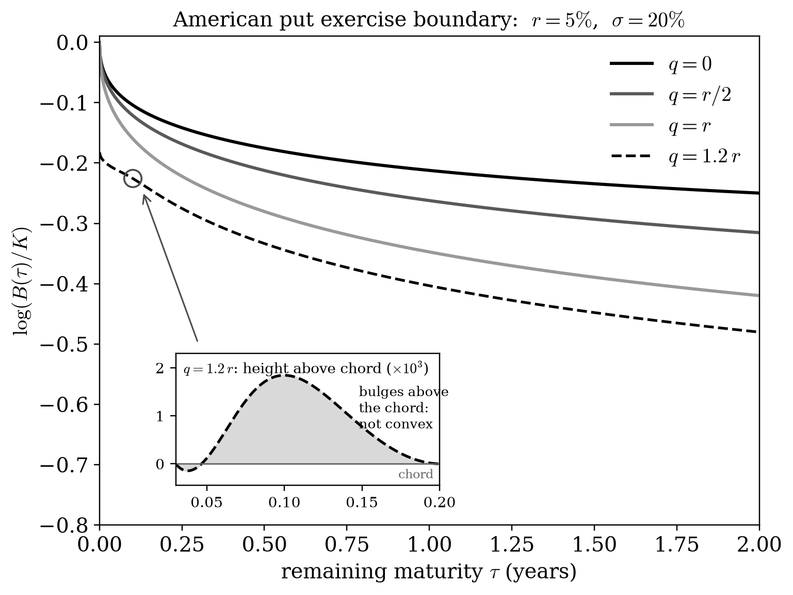

# Log-convexity of the exercise boundary of an American put option

Lean 4 formalization of a straight-line comparison proof that the logarithmic
exercise boundary is convex when the dividend yield does not exceed the
positive risk-free interest rate.

A draft of the accompanying paper is in [`paper/`](paper/). It has not yet
been submitted or peer reviewed.

**[Read the paper (draft)](paper/log-convexity.pdf)** ·
[LaTeX source](paper/log-convexity.tex) ·
[Proof audit](docs/straight-line-audit.md) ·
[Kernel-replay audit](docs/dependency-audit.md)



*The logarithm of the exercise boundary against remaining maturity for
$r=5\%$, $\sigma=20\%$, computed from Kim's integral equation. The curves
for $q\le r$ are convex; the dashed curve has $q=1.2\,r$, where convexity
is known to fail.*

## Result

Consider an American put option in the Black–Scholes model with constant
strike $K>0$, risk-free interest rate $r>0$, volatility $\sigma>0$, and
dividend yield $0\le q\le r$. Let $\tau$ denote time-to-expiry and
$B(\tau)$ the exercise boundary of the optimal-stopping value

$$
P(S,\tau)=\sup_{\theta\le\tau}
\mathbb E_S\!\left[e^{-r\theta}(K-S_\theta)^+\right],
\qquad dS=(r-q)S\,du+\sigma S\,dW.
$$

The supremum is over stopping times of the completed usual Brownian
filtration, with the horizon bound understood almost surely. At positive
time-to-expiry, exercise is optimal exactly for $0<S\le B(\tau)$.

The development proves two separate layers:

- **Geometric convexity:** $\tau\mapsto\log(B(\tau)/K)$ is convex, and
  $B$ is strictly decreasing and strictly convex on $(0,\infty)$. Strict
  decrease is derived from the stopping value, not assumed.
- **Classical curvature:** both boundaries are $C^2$ on $(0,\infty)$, and

$$
\frac{d^2}{d\tau^2}\log\frac{B(\tau)}K\ge0,
\qquad B''(\tau)>0.
$$

The geometric proof does not assume differentiability of the boundary.
The separate regularity development establishes the derivatives needed for
the classical conclusion. The final theorems concern the boundary constructed
from the stopping value, not an arbitrary assumed free-boundary solution.
They do **not** assert strictly positive logarithmic curvature.

**Context.** Convexity of the boundary was proved for $q=0$ by Ekström
(2004) and by Chen, Chadam, Jiang, and Zheng (2008), and for
$q+\sigma^2/2\le r$ by Liu (2017). Chen, Cheng, and Chadam (2013) showed
that it fails for $q$ slightly above $r$. The band
$r-\sigma^2/2<q\le r$ was open; for a stock paying a $3\%$ dividend at
$20\%$ volatility this is every interest rate between $3\%$ and $5\%$.
The present result covers all $0\le q\le r$ and gives log-convexity,
which is strictly stronger than convexity.

The zero-dividend case and the more restrictive regime
$r\ge q+\sigma^2/2$ have explicit theorem specializations. These are
checkpoints of the new argument, not independent formalizations of the
published proofs. The separate Chen–Chadam–Jiang–Zheng (CCJZ) proof track
remains unfinished; see the [CCJZ development notes](docs/ccjz-audit.md).
The manuscript discusses the historical dividend-paying question and the
known nonconvexity examples for $q>r$ sufficiently close to $r$; no claim
of nonconvexity for every $q>r$ is made.

## Proof sketch

Normalize by

$$
a=\sigma^2/2,\quad t=a\tau,\quad x=\log(S/K),\quad
k=r/a,\quad h=q/a,\quad \alpha=k-h-1.
$$

Write $p(x,t)=P(Ke^x,t/a)/K$ and $b(t)=\log(B(t/a)/K)$.
In continuation, $p_t=p_{xx}+\alpha p_x-kp$, with value matching
$p(b(t),t)=1-e^{b(t)}$ and right spatial smooth fit
$p_x(b(t)+,t)=-e^{b(t)}$.

### 1. Fit an exact comparison solution to a straight line

For $\ell(t)=d-ct$, with $c>0$ and $d<0$, set $z=x-\ell(t)$ and

$$
\widehat p(x,t)=f(z)-e^xg(z),
$$

where the elementary exponential profiles solve

$$
f''+(\alpha-c)f'-kf=0,\qquad
 g''+(\alpha+2-c)g'-hg=0,
$$

with $f(0)=g(0)=1$ and $f'(0)=g'(0)=0$. Both profiles are at least one.
The comparison solves the pricing PDE exactly and matches both payoff and
smooth fit along $x=\ell(t)$.

### 2. Show that the comparison dominates the payoff below the strike

For $H(z)=f(z)-1-e^{\ell+z}(g(z)-1)$, direct calculation gives

$$
H''+(\alpha-c)H'-kH
=k-he^{\ell+z}+ce^{\ell+z}(g(z)-1)\ge0
\quad\text{when }\ell+z\le0.
$$

The zero-data ODE kernel has the sign of its argument; integrating from
zero in either direction gives $H\ge0$. This is the key use of $h\le k$.
Consequently $p-\widehat p\le0$ on the actual exercise boundary.

### 3. Preserve the interval shape of positive superlevel sets

The normalized difference $v=(p-\widehat p)/f(z)$ satisfies

$$
v_t=v_{xx}+\left(\alpha+2f'(z)/f(z)\right)v_x,
$$

with no zero-order term, nonpositive left-boundary values, and a negative
far-field limit. At expiry and $x>0$, we have $v(x,0)=-1+e^d/R(x-d)$,
where $R(z)=e^{-z}f(z)/g(z)$. If $J=R'/R$, then $J(0)=-1$ and
$J=0\Rightarrow J'=c>0$. Thus $R$ decreases and then possibly increases,
so every initial strict superlevel set of $v$ at a nonnegative level is an interval.

A direct three-point maximum argument propagates

$$
\min\{v(x_1,t),v(x_3,t)\}\le\max\{v(x_2,t),0\},
\qquad x_1\le x_2\le x_3.
$$

Smooth approximations to the minimum and positive part turn a violation
into a spatially interior maximum on a compact truncated strip. At that maximum,
the three spatial first derivatives vanish, eliminating the drift, while
the PDE contradicts the sign of the time derivative. In particular,
$\{x:v(x,t)>0\}$ remains an interval. No Sturm zero-number theorem is needed.

### 4. Exclude a contact followed by a return below the line

Suppose $b$ is below $\ell$, meets it, and is below it again later.
At contact, $v$ and its right spatial derivative vanish. The later return
forces a positive interior point on the contact slice: otherwise the
maximum principle would prevent any subsequent positivity.

The interval property then supplies positivity in a backward rectangle
to the right of the line. In moving coordinates, compare with a small
multiple of $e^{Ay}-1$, choosing $A$ to dominate the drift. This stationary
barrier forces a strictly positive right spatial derivative at contact,
contradicting smooth fit. Hence $\{t:b(t)<d-ct\}$ is an interval.
The later return is essential; the argument does not say that the boundary
must stay below a line forever.

### 5. Deduce convexity without differentiating the boundary

The expiry estimate $b(t)/t\to-\infty$, together with the line-interval
property, first implies that $b(t)/t$ is nondecreasing. Chords of the
nonincreasing boundary therefore have nonpositive intercept. Raising a
negative-intercept chord slightly and applying the interval property gives
the convex chord inequality; zero-intercept and horizontal chords are
handled directly.

A separate barrier argument for positive time increments of the price rules
out a flat tail. Convexity and nonincrease then imply strict decrease.
Since the exponential is strictly convex, $B(\tau)=Ke^{b(a\tau)}$ is
strictly convex even though only nonstrict convexity of $b$ was proved.

### 6. Add classical regularity separately

The Lean regularity development derives boundary velocity from the Stefan
identity and proves sufficient heat-flux regularity to obtain $b\in C^2$.
Convexity gives $b''\ge0$, and convexity plus strict decrease gives $b'<0$.
Therefore

$$
B''(\tau)=Ka^2e^{b(a\tau)}
\left[b''(a\tau)+b'(a\tau)^2\right]>0.
$$

The paper uses established positive-time regularity for this last step;
Lean proves the required regularity from the stopping construction. The
paper also uses a European-price expiry asymptotic where Lean uses an
explicit square-root subsolution. See the [proof audit](docs/straight-line-audit.md)
for the correspondence and differences.

## Where to start in Lean

All theorem names below are in `AmericanPutConvexity.Stopping`.

| Purpose | Source / declaration |
| --- | --- |
| Geometric result in physical units | [PhysicalBoundaryConvexity.lean](AmericanPutConvexity/Stopping/PhysicalBoundaryConvexity.lean): `brownianUsualLogBoundary_convexOn`, `brownianUsualStockBoundary_strictConvexOn` |
| Core normalized convexity theorem | [ActualLogConvexity.lean](AmericanPutConvexity/Stopping/ActualLogConvexity.lean): `canonicalLogBoundary_convexOn` |
| Identification under normalization | [ActualBoundaryNormalization.lean](AmericanPutConvexity/Stopping/ActualBoundaryNormalization.lean) |
| Classical regularity and curvature | [PhysicalBoundaryCurvature.lean](AmericanPutConvexity/Stopping/PhysicalBoundaryCurvature.lean): `brownianUsualBoundary_classical_curvature` |
| Almost-sure horizon convention | [AEHorizonValue.lean](AmericanPutConvexity/Stopping/AEHorizonValue.lean), [AEHorizonCurvature.lean](AmericanPutConvexity/Stopping/AEHorizonCurvature.lean) |

For the comparison mechanism, start with
[Comparison.lean](AmericanPutConvexity/Boundary/Comparison.lean),
[ParabolicValley.lean](AmericanPutConvexity/Boundary/ParabolicValley.lean),
[ParabolicHopf.lean](AmericanPutConvexity/Boundary/ParabolicHopf.lean), and
[LineIntervalConvexity.lean](AmericanPutConvexity/Boundary/LineIntervalConvexity.lean).

## Build and reproduce the audit

Install [elan](https://github.com/leanprover/elan), clone this repository,
and run from its root:

```sh
lake exe cache get
lake build
```

The toolchain is pinned to Lean 4.32.0. Dependency revisions are recorded in
[lakefile.toml](lakefile.toml) and [lake-manifest.json](lake-manifest.json);
keep these aligned with [lean-toolchain](lean-toolchain). Do not run
`lake update` merely to reproduce the pinned build.

To replay the audited theorem dependency closure in a fresh Lean kernel:

```sh
lake env lean --run tools/ProofDependencyAudit.lean /tmp/american-convexity-audit.json --replay
```

The [recorded audit](docs/dependency-audit.md) reports 74,785 declarations
replayed, with only `propext`, `Classical.choice`, and `Quot.sound`, and no
`sorryAx` or project-added axioms. It includes negative controls and a
[machine-readable report](docs/audits/final-proof-dependencies.json).
This is a recorded local audit, not a claim that a fresh hosted CI run has
completed. The [GitHub Actions workflow](.github/workflows/lean_action_ci.yml)
builds the project and then replays the three headline modules with the
toolchain's built-in checker, described next.

Independently of the project script, the Lean toolchain ships
`leanchecker` (the upstreamed `lean4checker`), which re-typechecks every
declaration of a module through the kernel from its compiled `.olean`:

```sh
lake env leanchecker AmericanPutConvexity.Stopping.PhysicalBoundaryCurvature
```

Running it over all 339 project modules at the recorded snapshot returned
exit code 0 for every module. In this mode imported Mathlib and upstream
oleans are trusted as compiled; `leanchecker --fresh` would replay those
too, at a cost of hours over all of Mathlib.

Kernel replay checks the formal proof dependencies. It does not by itself
establish that the definitions capture the intended financial model; the
definitions that carry the statement's meaning are listed under
"What has to be trusted" below.

## Dependencies and attribution

The development uses [Mathlib](https://github.com/leanprover-community/mathlib4),
the [BrownianMotion](https://github.com/RemyDegenne/brownian-motion) library
of Degenne, Ledvinka, Marion, and Pfaffelhuber
([arXiv:2511.20118](https://arxiv.org/abs/2511.20118)), and
[MathFin](https://github.com/formal-applied-math/formal-mathfin).
MathFin contributes GBM definitions, stochastic calculus, filtration machinery,
and heat-kernel tools; the boundary-convexity argument is proved here, not
imported from an upstream pricing theorem. The
[dependency audit](docs/dependency-audit.md) records the exact upstream use.
Bibliographic references, including Mathlib and MathFin, are in the
[paper bibliography](paper/references.bib).

**What has to be trusted.** A kernel-checked theorem is only as meaningful
as the definitions in its statement. Following definitions (but not proofs)
outward from the final theorems, the statement's meaning depends on Mathlib,
the Kolmogorov extension construction, and exactly these upstream
definitions: `gaussianLimit` (the projective limit of centered Gaussians
with covariance $\min(s,t)$), `preBrownian` (the coordinate process),
`brownian` (its continuous modification chosen from the Kolmogorov–Chentsov
theorem), `gbmValue` ($S\exp((\mu-\sigma^2/2)t+\sigma x)$), and a null-set
σ-algebra used to augment the filtration. Every other upstream constant in
the dependency cone sits in proof position, where its correctness is
checked by the kernel rather than assumed.

The pinned BrownianMotion revision contains three declarations that depend
on `sorry`, all in its in-progress stochastic-integration files. None of
them is in the dependency cone of the final theorems; the audit above
verifies this from the kernel environment, independently of Lean's cached
axiom summaries.

Author: Robert Martin, Dianoa Labs. The proof, Lean development, and manuscript
were produced with substantial AI assistance. The author-supplied account and
model attributions appear in Appendix I of the [paper](paper/log-convexity.pdf).
Model agreement is not independent peer review; publication priority and an
independent mathematical audit are not claimed here.

The code is released under the [Apache License 2.0](LICENSE), matching
Mathlib and the BrownianMotion library. Citation metadata is in
[CITATION.cff](CITATION.cff).

For manuscript build instructions, see [paper/README.md](paper/README.md).
Older development notes under `docs/` retain historical checkpoints and may
describe limitations superseded by the results above; the Git history retains
the previous detailed README.
